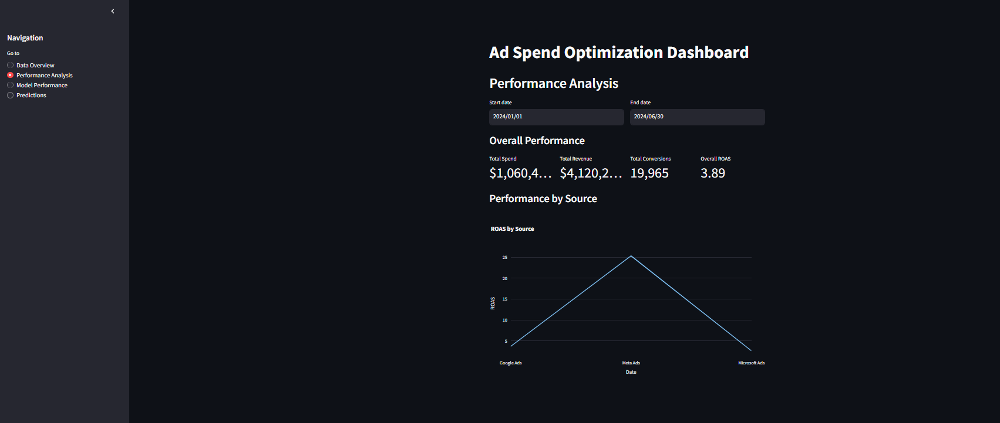
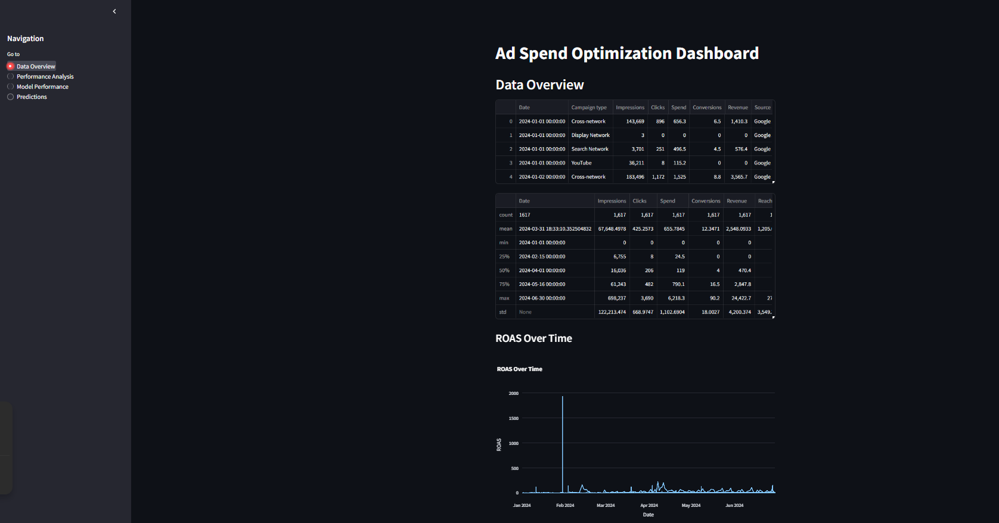

# DigitalMarketingAIOptimization
# AI-Driven Media Investment Plan Optimization

## Table of Contents
1. [Project Overview](#project-overview)
2. [Data Preprocessing](#data-preprocessing)
3. [Feature Engineering](#feature-engineering)
4. [Model Development](#model-development)
5. [Evaluation Metrics](#evaluation-metrics)
6. [Optimization App](#optimization-app)
7. [Installation and Usage](#installation-and-usage)
8. [Contributing](#contributing)
9. [License](#license)

## Project Overview

This project aims to develop an AI-driven media investment plan for e-commerce businesses. The goal is to optimize budget allocation across various paid media channels to maximize customer acquisition and conversion rates. By analyzing the performance of each channel throughout different phases of the customer journey, we use machine learning to identify trends and patterns, ultimately leading to more effective budget allocation strategies.




### Key Components:
- Data preprocessing and integration from multiple sources
- Feature engineering to capture complex relationships
- Development of machine learning models for performance prediction
- Custom evaluation metrics for ad spend optimization
- Interactive dashboard for visualizing results and making decisions
- API for model serving and integration with existing systems

### Project structure
``` txt
.
├── LICENSE
├── README.md
├── RamHos_DigitalMarketingAIOptimization.ipynb.ipynb
├── __pycache__
│   └── updated_data_loader.cpython-310.pyc
├── app
│   ├── api
│   │   ├── __pycache__
│   │   │   └── main.cpython-310.pyc
│   │   └── main.py
│   ├── dashboard
│   │   └── app.py
│   └── requirements.txt
├── app_run.ipynb
├── cd
├── config
│   └── config.py
├── data
│   ├── processed
│   │   ├── combined_ad_data.csv
│   │   ├── feature_engineered_data.csv
│   │   └── featured_data_with_anomalies.csv
│   ├── raw
│   │   ├── googleads-performance.csv
│   │   ├── metaads-performance.csv
│   │   ├── microsoftads-performance.csv
│   │   └── website-landings.csv
│   └── synthetic
│       └── synthetic_ad_data.csv
├── docker_file_content.txt
├── documentation
│   ├── DataPreprocessing.md
│   └── FeaturePreprocessing.md
├── file_structure.txt
├── logger.py
├── netelixir_dashboard_1.png
├── netelixir_dashboard_2.png
├── ngrok
├── notebooks
│   ├── 01_data_exploration.ipynb
│   ├── 02_in_depth_analysis.ipynb
│   ├── 03_feature_engineering.ipynb
│   ├── 04_model_development.ipynb
│   ├── 05_model_evaluation.ipynb
│   ├── 06_synthetic_data_generation.ipynb
│   └── main.ipynb
├── plots
│   ├── 02_in_depth_analysis
│   │   ├── anomaly_detection.png
│   │   ├── correlation_heatmap.png
│   │   ├── current_budget_allocation.png
│   │   ├── efficiency_metric_CTR.png
│   │   ├── efficiency_metric_CVR.png
│   │   ├── efficiency_metric_ROAS.png
│   │   ├── platform_comparison_CPC.png
│   │   ├── platform_comparison_CTR.png
│   │   ├── platform_comparison_CVR.png
│   │   ├── platform_comparison_Clicks.png
│   │   ├── platform_comparison_Conversions.png
│   │   ├── platform_comparison_Impressions.png
│   │   ├── platform_comparison_ROAS.png
│   │   ├── platform_comparison_Revenue.png
│   │   ├── platform_comparison_Spend.png
│   │   ├── revenue_distribution.png
│   │   ├── time_series_decomposition_Conversions.png
│   │   ├── time_series_decomposition_Revenue.png
│   │   ├── time_series_decomposition_Spend.png
│   │   └── top_campaigns_ROAS.png
│   ├── ROAS_campaign_wise.png
│   ├── correlation_heatmap.png
│   ├── distribution_of_key_metrics.png
│   ├── performance_by_score.png
│   ├── spend_vs_revenue_by_source.png
│   └── timeseries_key_metrics.png
├── requirements.txt
├── setup.py
├── src
│   ├── __init__.py
│   ├── __pycache__
│   │   └── __init__.cpython-310.pyc
│   ├── data
│   │   ├── __pycache__
│   │   │   ├── data_loader.cpython-310.pyc
│   │   │   └── data_preprocessor.cpython-310.pyc
│   │   ├── data_loader.py
│   │   └── data_preprocessor.py
│   ├── features
│   │   ├── __pycache__
│   │   │   ├── feature_engineering.cpython-310.pyc
│   │   │   └── feature_selection.cpython-310.pyc
│   │   ├── feature_engineering.py
│   │   └── feature_selection.py
│   ├── models
│   │   ├── __init__.py
│   │   ├── __pycache__
│   │   │   ├── __init__.cpython-310.pyc
│   │   │   ├── ensemble_model.cpython-310.pyc
│   │   │   ├── model_evaluator.cpython-310.pyc
│   │   │   ├── model_trainer.cpython-310.pyc
│   │   │   └── time_series_models.cpython-310.pyc
│   │   ├── ensemble_model.py
│   │   ├── model_evaluator.py
│   │   ├── model_trainer.py
│   │   └── time_series_models.py
│   ├── synthetic
│   │   ├── __pycache__
│   │   │   └── synthetic_data_generator.cpython-310.pyc
│   │   └── synthetic_data_generator.py
│   └── utils
│       ├── __pycache__
│       │   ├── anomaly_detection.cpython-310.pyc
│       │   ├── causality_analysis.cpython-310.pyc
│       │   ├── model_interpretation.cpython-310.pyc
│       │   ├── online_learning.cpython-310.pyc
│       │   ├── visualization.cpython-310.pyc
│       │   └── visualizations_app.cpython-310.pyc
│       ├── anomaly_detection.py
│       ├── causality_analysis.py
│       ├── experiment_tracker.py
│       ├── model_interpretation.py
│       ├── monitoring.py
│       ├── online_learning.py
│       ├── visualization.py
│       └── visualizations_app.py
├── tests
│   └── test_api.py
└── updated_data_loader.py

27 directories, 100 files

```


## Data Preprocessing

Our data preprocessing pipeline integrates data from multiple sources:

1. Google Ads performance data
2. Meta Ads performance data
3. Microsoft Ads performance data
4. Website landing and conversion data

The preprocessing steps include:

- Data cleaning and normalization
- Merging datasets based on common fields (Date, Source, Campaign type)
- Handling missing values and outliers
- Calculating derived metrics

Key derived metrics include:

1. Click-Through Rate (CTR):
   $CTR = \frac{Clicks}{Impressions}$

2. Cost Per Click (CPC):
   $CPC = \frac{Spend}{Clicks}$

3. Conversion Rate (CVR):
   $CVR = \frac{Conversions}{Clicks}$

4. Return on Ad Spend (ROAS):
   $ROAS = \frac{Revenue}{Spend}$

[Placeholder for Data Distribution Plot]

## Feature Engineering

We engineer several features to capture the complexities of ad performance:

1. Time-based features:
   - Day of week
   - Month
   - Quarter
   - Is_weekend (binary)

2. Rolling averages:
   - 7-day rolling average of CTR, CPC, CVR, and ROAS
   - 30-day rolling average of CTR, CPC, CVR, and ROAS

3. Relative performance metrics:
   - CTR_ratio = $\frac{CTR}{Avg\_CTR\_for\_channel}$
   - CPC_ratio = $\frac{CPC}{Avg\_CPC\_for\_channel}$
   - CVR_ratio = $\frac{CVR}{Avg\_CVR\_for\_channel}$
   - ROAS_ratio = $\frac{ROAS}{Avg\_ROAS\_for\_channel}$

4. Channel interaction features:
   - Channel_diversity = $1 - \frac{\sum_{i=1}^{n} (channel\_spend_i / total\_spend)^2}{n}$
   where $n$ is the number of channels

[Placeholder for Feature Importance Plot]

## Model Development

We develop multiple models to predict ad performance and optimize budget allocation:

1. Random Forest Regressor
2. XGBoost Regressor
3. Deep Neural Network (DNN)

For the DNN, we use the following architecture:

```
Input Layer (n_features) -> Dense(64, ReLU) -> Dense(32, ReLU) -> Dense(16, ReLU) -> Output(1)
```

[Placeholder for Model Architecture Diagram]

## Evaluation Metrics

We use the following metrics to evaluate our models:

1. Mean Absolute Error (MAE):
   $MAE = \frac{1}{n} \sum_{i=1}^{n} |y_i - \hat{y}_i|$

2. Root Mean Squared Error (RMSE):
   $RMSE = \sqrt{\frac{1}{n} \sum_{i=1}^{n} (y_i - \hat{y}_i)^2}$

3. R-squared (R²):
   $R^2 = 1 - \frac{\sum_{i=1}^{n} (y_i - \hat{y}_i)^2}{\sum_{i=1}^{n} (y_i - \bar{y})^2}$

4. Custom Budget Allocation Efficiency (BAE):
   $BAE = \frac{\sum_{i=1}^{n} (Revenue_i - Spend_i)}{\sum_{i=1}^{n} Spend_i}$

[Placeholder for Model Performance Comparison Plot]

## Optimization App

Our optimization app provides an interactive interface for marketers to:

1. Visualize current ad performance across channels
2. Input new budget constraints
3. Generate optimized budget allocation recommendations
4. Compare predicted performance of optimized vs. current allocation

[Placeholder for App Screenshot]

## Installation and Usage

```bash
# Clone the repository
git clone https://github.com/yourusername/ai-media-investment-plan.git

# Change to the project directory
cd ai-media-investment-plan

# Install dependencies
pip install -r requirements.txt

# Run the preprocessing pipeline
python src/data/data_preprocessor.py

# Train the models
python src/models/model_trainer.py

# Start the optimization app
streamlit run app/dashboard/app.py
```

## Contributing

We welcome contributions to improve this project. Please follow these steps:

1. Fork the repository
2. Create a new branch (`git checkout -b feature/your-feature-name`)
3. Make your changes and commit them (`git commit -am 'Add some feature'`)
4. Push to the branch (`git push origin feature/your-feature-name`)
5. Create a new Pull Request

## License

This project is licensed under the MIT License - see the [LICENSE](LICENSE) file for details.